# Godev — Master Development Plan (v7 — Hardened)

> **Project**: Programmers/Developers Networking Platform
> **Stack**: React 19 + Vite 8 | Zustand 5 | Express 5 + TypeScript | PostgreSQL 15 | Prisma 7
> **Architecture**: SPA with layered backend — `Router → Controller → Service → Prisma Data Access`

> [!IMPORTANT]
> **v7 Revision Summary** — Twenty-seven critical architectural flaws have been corrected across v2–v7:
>
> **v2 fixes (from v1):**
> 1. Polymorphic anti-pattern → Dedicated per-entity tables with strict FKs
> 2. Offset pagination on feeds/messaging → Cursor-based keyset pagination
> 3. Missing indexes → Composite B-Tree indexes for feed and full-text GIN indexes
> 4. ILIKE search → Stored `tsvector` columns with GIN indexes + DB triggers
> 5. Hard-delete cascade bomb → Ghost User soft-delete with 30-day PII purge
> 6. Polling DDOS → Server-Sent Events (SSE) for real-time messaging
>
> **v3 fixes (from v2):**
> 7. **Cursor collision** → Composite `(createdAt, id)` keyset
> 8. **Postgres IMMUTABLE violation** → `BEFORE INSERT OR UPDATE` triggers
> 9. **Computed sort catastrophe** → Denormalized `likeCount` column
> 10. **SSE connection leak** → Per-user cap + async event emitter
>
> **v4 fixes (from v3):**
> 11. **httpOnly logout fantasy** → Server-side `res.clearCookie()`
> 12. **Prisma tuple-cursor hallucination** → Prisma-native `cursor: { id }` + `orderBy`
> 13. **Tsvector 1MB kill-switch** → `LEFT()` truncation to 500KB
> 14. **MVCC read receipt amplification** → High-Water Mark on `ConversationParticipant`
>
> **v5 fixes (from v4):**
> 15. **PII data leak** → Global `prisma.$extends` strips `passwordHash`
> 16. **Relational division trap** → `skillNames String[]` + GIN `@>` operator
> 17. **QueryRaw array crash** → `Prisma.join()` / database subqueries
> 18. **Analytics sequential scan** → Composite `@@index([followingId, createdAt])`
> 19. **Job search company omission** → `company` added to job tsvector trigger
>
> **v6 fixes (from v5):**
> 20. **SSE auto-reconnect DDOS** → `event: session_replaced` before eviction
> 21. **Dual-write split-brain** → `JobSkill` junction table removed
> 22. **Rule-based security fallacy** → `prisma.$extends` replaces manual `omit`
> 23. **IN() clause memory bomb** → Database-side subqueries
>
> **v7 fixes (from v6):**
> 24. **SetNull on NOT NULL crash** → `onDelete: SetNull` on required `authorId`/`senderId`/`receiverId` fields is a fatal PostgreSQL contradiction. Changed to `onDelete: Restrict` — Ghost User pattern ensures users are never hard-deleted
> 25. **High-Water Mark race condition** → `lastReadAt = NOW()` loses messages arriving during the HTTP roundtrip. Now uses client-provided `lastSeenMessageId` to set `lastReadAt = message.createdAt`
> 26. **Viral lock contention** → Interactive `prisma.$transaction` holds connections across event loop ticks, exhausting the pool on viral posts. Replaced with single-statement `$executeRaw` atomic increment
> 27. **Case-sensitive GIN trap** → `skillNames` array normalized to lowercase on write; queries also lowercase. `ARRAY['React'] @> ARRAY['react']` now matches

---

## Table of Contents

1. [Conventions & Standards](#1-conventions--standards)
2. [Phase 0 — Project Scaffolding](#phase-0--project-scaffolding)
3. [Phase 1 — Database Schema & ERD](#phase-1--database-schema--erd)
4. [Phase 2 — Core Auth](#phase-2--core-auth)
5. [Phase 3 — User Profiles](#phase-3--user-profiles)
6. [Phase 4 — Content Engine (Posts & Projects)](#phase-4--content-engine)
7. [Phase 5 — Social Graph](#phase-5--social-graph)
8. [Phase 6 — Feed & Search](#phase-6--feed--search)
9. [Phase 7 — Messaging](#phase-7--messaging)
10. [Phase 8 — Job Board](#phase-8--job-board)
11. [Phase 9 — Analytics](#phase-9--analytics)
12. [Phase 10 — Polish & Hardening](#phase-10--polish--hardening)

---

## 1. Conventions & Standards

### 1.1 Backend Layered Architecture

Every feature **must** follow this call chain — no skipping layers:

```
Route (validation + auth guard)
  → Controller (parse req, call service, send res)
    → Service (business logic, transactions)
      → Prisma Client (data access only)
```

| Layer | Allowed Imports | Responsibility |
|---|---|---|
| `routes/*.ts` | controller, middleware | Define HTTP verbs, attach validators & auth guards |
| `controllers/*.ts` | service | Parse `req.params/body/query`, call service, format `res.json` |
| `services/*.ts` | prisma client, utils | All business rules, multi-table transactions, error throwing |
| `models/prisma.ts` | `@prisma/client` | Single shared `PrismaClient` instance export |

### 1.2 Standardized API Response Envelope

Every endpoint **must** return this shape:

```typescript
// Success (offset-paginated lists — Search, Jobs, Users)
// NOTE: 'total' is removed to prevent O(N) COUNT(*) scans on GIN indexes. Use hasMore.
{ "success": true, "data": T[], "meta": { "page": number, "limit": number, "hasMore": boolean } }

// Success (cursor-paginated lists — Feed, Messages)
// v4: nextCursor is the `id` (UUID) of the last returned item. Passed directly to Prisma's `cursor: { id }`.
{ "success": true, "data": T[], "meta": { "nextCursor": string | null, "hasMore": boolean } }

// Success (single resource)
{ "success": true, "data": T }

// Error
{ "success": false, "error": { "code": string, "message": string, "details"?: unknown } }
```

### 1.3 Standardized Error Handling

Create a global `errorHandler` middleware and a custom `AppError` class:

```
AppError(statusCode, code, message, details?)
```

| HTTP Code | `code` constant | When to use |
|---|---|---|
| 400 | `VALIDATION_ERROR` | Zod parse failure, bad request body |
| 401 | `UNAUTHORIZED` | Missing or expired JWT |
| 403 | `FORBIDDEN` | Valid JWT but insufficient permissions |
| 404 | `NOT_FOUND` | Resource does not exist |
| 409 | `CONFLICT` | Duplicate email/username |
| 422 | `UNPROCESSABLE` | Business rule violation (e.g. self-follow) |
| 429 | `RATE_LIMITED` | Too many requests |
| 500 | `INTERNAL_ERROR` | Catch-all for unexpected failures |

### 1.4 Input Validation

- Use **Zod** for all request body/query/param validation.
- Define schema files in `src/validators/<feature>.validator.ts`.
- Apply via a reusable `validate(schema)` middleware in the route layer.

### 1.5 Pagination Strategy

> [!WARNING]
> **This is non-negotiable.** Using the wrong pagination type will cause O(N) degradation.

| Pattern | Use For | Why |
|---|---|---|
| **Cursor-based** (keyset) | Feed, Messages, Followers/Following | Append-heavy timelines where OFFSET degrades to full table scans. **v4: Uses Prisma's native cursor API**, not raw SQL tuple comparisons. Pattern: `prisma.post.findMany({ cursor: { id: lastItemId }, skip: 1, take: limit, orderBy: [{ createdAt: 'desc' }, { id: 'desc' }] })`. Prisma internally generates the correct `WHERE (createdAt, id) < (...)` keyset SQL from the `cursor` + `orderBy` combination. The `cursor` value sent to the client is simply the `id` (UUID string) of the last returned item — **not** a Base64-encoded JSON object. The `id` field is `@id` and therefore inherently `@unique`, satisfying Prisma's cursor constraint. Constant-time regardless of depth. |
| **Offset-based** (page/limit) | Search results, Job listings, User search | Bounded filtered result sets where users expect page numbers. OFFSET on a filtered index is acceptable at this scale. |

### 1.6 Frontend Conventions

| Concern | Convention |
|---|---|
| State | One Zustand store file per domain: `useAuthStore`, `usePostStore`, etc. |
| API calls | Centralized in `src/api/<feature>.api.ts` using a shared `axios` instance with interceptors |
| Pages | `src/pages/<PageName>.tsx` — each is a route target |
| Components | `src/components/<Feature>/<ComponentName>.tsx` |
| Types | Shared TS types in `src/types/<feature>.types.ts` |

### 1.7 Prisma Field Exclusion (PII Safety)

> [!CAUTION]
> **v5 fix**: Prisma's `findUnique`, `findMany`, and all read operations return **every scalar field by default**, including `passwordHash`. If a controller calls `res.json(user)`, the password hash is serialized and sent to the client. This is a **critical security vulnerability**.
>
> **v6 fix**: Manual `omit: { passwordHash: true }` on every query is a **rule-based security fallacy** — the moment a junior developer forgets it under a deadline, the system leaks credentials. This must be enforced **structurally**, not procedurally.

**Mandatory implementation**: Create the extended Prisma client in `src/models/prisma.ts` using `$extends` to **globally strip `passwordHash`** from all User query results:

```typescript
import { PrismaClient } from '@prisma/client';

const basePrisma = new PrismaClient();

// v6: Global PII interception — passwordHash is NEVER returned to application code.
// The only way to read passwordHash is via prisma.$queryRaw (used in auth.service.ts login).
export const prisma = basePrisma.$extends({
  result: {
    user: {
      passwordHash: {
        needs: {},
        compute() {
          return undefined;
        },
      },
    },
  },
});

// v6: Export base client ONLY for auth.service.ts login/confirmReset (needs raw passwordHash)
export const unsafePrisma = basePrisma;
```

All application code imports `prisma` (the extended client). **Only** `auth.service.ts` may import `unsafePrisma` for `login()` and `confirmReset()` which need to verify the password hash. This is a **structural guarantee** — no developer can accidentally leak `passwordHash` regardless of whether they remember to use `omit`.

---

## Phase 0 — Project Scaffolding

> **Goal**: Establish the folder structure, shared utilities, and dev tooling so all subsequent phases slot in cleanly.

### Backend Tasks

- [ ] **B-0.1** Create the Prisma client singleton at `src/models/prisma.ts` **using the `$extends` pattern from §1.7**. Export `prisma` (extended, PII-safe) and `unsafePrisma` (raw, auth-only).
- [ ] **B-0.2** Create `src/utils/AppError.ts` — custom error class with `statusCode`, `code`, `message`, `details`.
- [ ] **B-0.3** Create `src/middlewares/errorHandler.ts` — Express error middleware that catches `AppError` and formats the standard envelope. Must **never** leak stack traces in production (`NODE_ENV !== 'development'`).
- [ ] **B-0.4** Create `src/middlewares/validate.ts` — generic middleware factory accepting a Zod schema, validates `req.body` / `req.query` / `req.params`.
- [ ] **B-0.5** Install `jsonwebtoken`, `zod`, `cookie-parser`. Add `@types/jsonwebtoken`, `@types/cookie-parser` to devDeps.
- [ ] **B-0.6** Wire up `src/index.ts`: create Express app, attach `cors`, `cookieParser`, `express.json()`, mount a health-check route `GET /api/health`, attach `errorHandler` last.
- [ ] **B-0.7** Add `"dev": "nodemon --exec ts-node src/index.ts"` script to `package.json`.

### Frontend Tasks

- [ ] **F-0.1** Install `react-router-dom`, `axios`, `react-markdown`, `react-syntax-highlighter`, `lucide-react`.
- [ ] **F-0.2** Create folder skeleton: `src/api/`, `src/stores/`, `src/pages/`, `src/components/`, `src/types/`, `src/hooks/`, `src/lib/`.
- [ ] **F-0.3** Create `src/api/client.ts` — axios instance with `baseURL: '/api'`, response interceptor that reads the standard envelope and throws on `success: false`.
- [ ] **F-0.4** Configure `vite.config.ts` proxy: `'/api' → 'http://localhost:3000'`.
- [ ] **F-0.5** Set up React Router in `App.tsx` with placeholder route stubs for `/login`, `/register`, `/feed`, `/profile/:id`.

### Definition of Done

- `npm run dev` starts both backend (port 3000) and frontend (port 5173) without errors.
- `GET /api/health` returns `{ "success": true, "data": { "status": "ok" } }`.
- Sending a malformed POST body to any future endpoint will be caught by the `validate` middleware and return a `400 VALIDATION_ERROR` envelope.

---

## Phase 1 — Database Schema & ERD

> **Goal**: Design **all** tables up-front before writing application logic. This is the single source of truth.

### 1.1 Architectural Decisions

> [!IMPORTANT]
> **No Polymorphic Tables.** v1 used a `contentType` enum with nullable `postId`/`projectId` columns for Like, Save, Report, and Comment. This is the "Exclusive Arc" anti-pattern — PostgreSQL cannot enforce that exactly one FK is non-null, leading to orphaned records and broken JOINs. **v2 uses dedicated per-entity tables**: `PostLike`/`ProjectLike`, `PostSave`/`ProjectSave`, `PostComment`/`ProjectComment`, `PostReport`/`ProjectReport`. Every FK is NOT NULL with strict referential integrity.

> [!IMPORTANT]
> **Ghost User Pattern for Account Deletion.** Hard-deleting a user cascades to all their sent messages, destroying recipients' chat history. Instead: `deleteAccount()` sets `status = DELETED`, replaces PII fields with `[deleted]`, and nullifies optional fields. A scheduled job purges hard-deletable data after 30 days. Messages and comments are preserved with the anonymized ghost profile.

### 1.2 Entity-Relationship Diagram

```mermaid
erDiagram
    User ||--o{ Post : "authors"
    User ||--o{ Project : "authors"
    User ||--o{ PostComment : "writes"
    User ||--o{ ProjectComment : "writes"
    User ||--o{ PostLike : "gives"
    User ||--o{ ProjectLike : "gives"
    User ||--o{ PostSave : "bookmarks"
    User ||--o{ ProjectSave : "bookmarks"
    User ||--o{ PostReport : "files"
    User ||--o{ ProjectReport : "files"
    User ||--o{ Follow : "follows"
    User ||--o{ Follow : "followed_by"
    User ||--o{ Block : "blocks"
    User ||--o{ Block : "blocked_by"
    User ||--o{ Message : "sends"
    User ||--o{ Message : "receives"
    User ||--o{ Job : "posts"
    User ||--o{ UserSkill : "has"
    User ||--o{ PasswordResetToken : "requests"
    User ||--o{ ConversationParticipant : "joins"

    Post ||--o{ PostComment : "has"
    Post ||--o{ PostLike : "has"
    Post ||--o{ PostSave : "has"
    Post ||--o{ PostReport : "has"
    Post ||--o{ PostTag : "tagged_with"

    Project ||--o{ ProjectComment : "has"
    Project ||--o{ ProjectLike : "has"
    Project ||--o{ ProjectSave : "has"
    Project ||--o{ ProjectReport : "has"
    Project ||--o{ ProjectTag : "tagged_with"

    Job ||--|| User : "posted_by"
    Skill ||--o{ UserSkill : "referenced_by"
    Tag ||--o{ PostTag : "applied_to"
    Tag ||--o{ ProjectTag : "applied_to"

    Conversation ||--o{ Message : "contains"
    Conversation ||--o{ ConversationParticipant : "has"
```



### 1.3 Complete Prisma Schema

```prisma
generator client {
  provider        = "prisma-client-js"
  previewFeatures = ["fullTextSearchPostgres"]
}

datasource db {
  provider = "postgresql"
  url      = env("DATABASE_URL")
}

// ─── ENUMS ────────────────────────────────────────────

enum AccountStatus {
  ACTIVE
  DEACTIVATED
  DELETED       // Ghost user — PII scrubbed, profile anonymized
  BANNED
}

enum ReportStatus {
  PENDING
  REVIEWED
  DISMISSED
}

enum JobStatus {
  OPEN
  CLOSED
  DRAFT
}

// ─── USER ─────────────────────────────────────────────

model User {
  id             String        @id @default(uuid())
  email          String        @unique
  username       String        @unique
  passwordHash   String        @map(password_hash)
  displayName    String        @map(display_name)
  bio            String?
  avatarUrl      String?       @map(avatar_url)
  websiteUrl     String?       @map(website_url)
  githubUrl      String?       @map(github_url)
  linkedinUrl    String?       @map(linkedin_url)
  location       String?
  status         AccountStatus @default(ACTIVE)
  deletedAt      DateTime?     @map(deleted_at) // Set when status transitions to DELETED
  createdAt      DateTime      @default(now()) @map(created_at)
  updatedAt      DateTime      @updatedAt @map(updated_at)

  // Content
  posts             Post[]
  projects          Project[]
  postComments      PostComment[]
  projectComments   ProjectComment[]
  postLikes         PostLike[]
  projectLikes      ProjectLike[]
  postSaves         PostSave[]
  projectSaves      ProjectSave[]
  postReports       PostReport[]
  projectReports    ProjectReport[]
  skills            UserSkill[]
  jobs              Job[]
  resetTokens       PasswordResetToken[]

  // Social graph
  following      Follow[]  @relation("follower")
  followers      Follow[]  @relation("following")
  blocking       Block[]   @relation("blocker")
  blockedBy      Block[]   @relation("blocked")

  // Messaging
  sentMessages       Message[]                @relation("sender")
  receivedMessages   Message[]                @relation("receiver")
  conversations      ConversationParticipant[]

  @@index([status])
  @@map("users")
}

model PasswordResetToken {
  id        String   @id @default(uuid())
  token     String   @unique
  userId    String   @map(user_id)
  user      User     @relation(fields: [userId], references: [id], onDelete: Cascade)
  expiresAt DateTime @map(expires_at)
  usedAt    DateTime? @map(used_at)
  createdAt DateTime @default(now()) @map(created_at)

  @@index([userId])
  @@map("password_reset_tokens")
}

// ─── SKILLS & TAGS ────────────────────────────────────

model Skill {
  id        String      @id @default(uuid())
  name      String      @unique
  users     UserSkill[]
  // v6: JobSkill junction table removed. Skill table is now autocomplete/reference only.
  // Job.skillNames String[] is the single source of truth for job-skill associations.

  @@map("skills")
}

model UserSkill {
  userId  String @map(user_id)
  skillId String @map(skill_id)
  user    User   @relation(fields: [userId], references: [id], onDelete: Cascade)
  skill   Skill  @relation(fields: [skillId], references: [id], onDelete: Cascade)

  @@id([userId, skillId])
  @@map("user_skills")
}

model Tag {
  id       String       @id @default(uuid())
  name     String       @unique
  posts    PostTag[]
  projects ProjectTag[]

  @@map("tags")
}

// ─── POST ─────────────────────────────────────────────

model Post {
  id        String   @id @default(uuid())
  authorId  String   @map("author_id")
  author    User     @relation(fields: [authorId], references: [id], onDelete: Restrict)  // v7: Restrict, not SetNull — authorId is NOT NULL and Ghost User pattern prevents hard deletion
  title     String
  body      String
  likeCount Int      @default(0)  @map("like_count")  // v3: Denormalized counter. v7: Maintained by single-statement $executeRaw atomic increment (not interactive $transaction). Enables O(1) ORDER BY for recommended feed.
  createdAt DateTime @default(now()) @map(created_at)
  updatedAt DateTime @updatedAt @map(updated_at)

  tags      PostTag[]
  comments  PostComment[]
  likes     PostLike[]
  saves     PostSave[]
  reports   PostReport[]

  // Following feed: WHERE authorId IN (...) ORDER BY createdAt DESC, id DESC
  @@index([authorId, createdAt(sort: Desc)])
  @@index([createdAt(sort: Desc)])
  // v3: Recommended feed index — stable sort by likeCount with (createdAt, id) tie-breaker for deterministic cursor pagination
  @@index([likeCount(sort: Desc), createdAt(sort: Desc)])
  @@map("posts")
}

model PostTag {
  postId String @map(post_id)
  tagId  String @map(tag_id)
  post   Post   @relation(fields: [postId], references: [id], onDelete: Cascade)
  tag    Tag    @relation(fields: [tagId], references: [id], onDelete: Cascade)

  @@id([postId, tagId])
  @@map("post_tags")
}

// ─── PROJECT ──────────────────────────────────────────

model Project {
  id            String   @id @default(uuid())
  authorId      String   @map(author_id)
  author        User     @relation(fields: [authorId], references: [id], onDelete: SetNull)
  title         String
  description   String
  repositoryUrl String?  @map(repository_url)
  liveUrl       String?  @map(live_url)
  likeCount     Int      @default(0)  @map(like_count)  // v3: Denormalized counter. v7: Same atomic $executeRaw pattern as Post.likeCount
  createdAt     DateTime @default(now()) @map(created_at)
  updatedAt     DateTime @updatedAt @map(updated_at)

  tags      ProjectTag[]
  comments  ProjectComment[]
  likes     ProjectLike[]
  saves     ProjectSave[]
  reports   ProjectReport[]

  // Following feed: WHERE authorId IN (...) ORDER BY createdAt DESC, id DESC
  @@index([authorId, createdAt(sort: Desc)])
  @@index([createdAt(sort: Desc)])
  // v3: Recommended feed index
  @@index([likeCount(sort: Desc), createdAt(sort: Desc)])
  @@map("projects")
}

model ProjectTag {
  projectId String  @map(project_id)
  tagId     String  @map(tag_id)
  project   Project @relation(fields: [projectId], references: [id], onDelete: Cascade)
  tag       Tag     @relation(fields: [tagId], references: [id], onDelete: Cascade)

  @@id([projectId, tagId])
  @@map("project_tags")
}

// ─── POST ENGAGEMENT (dedicated tables, strict FKs) ──

model PostComment {
  id        String   @id @default(uuid())
  authorId  String   @map(author_id)
  author    User     @relation(fields: [authorId], references: [id], onDelete: Restrict)  // v7: Restrict — see Post.author
  postId    String   @map(post_id)
  post      Post     @relation(fields: [postId], references: [id], onDelete: Cascade)
  body      String
  createdAt DateTime @default(now()) @map(created_at)
  updatedAt DateTime @updatedAt

  @@index([postId, createdAt(sort: Desc)])
  @@map("post_comments")
}

model PostLike {
  id        String   @id @default(uuid())
  userId    String   @map(user_id)
  user      User     @relation(fields: [userId], references: [id], onDelete: Cascade)
  postId    String   @map(post_id)
  post      Post     @relation(fields: [postId], references: [id], onDelete: Cascade)
  createdAt DateTime @default(now()) @map(created_at)

  @@unique([userId, postId])
  @@map("post_likes")
}

model PostSave {
  id        String   @id @default(uuid())
  userId    String   @map(user_id)
  user      User     @relation(fields: [userId], references: [id], onDelete: Cascade)
  postId    String   @map(post_id)
  post      Post     @relation(fields: [postId], references: [id], onDelete: Cascade)
  createdAt DateTime @default(now()) @map(created_at)

  @@unique([userId, postId])
  @@map("post_saves")
}

model PostReport {
  id         String       @id @default(uuid())
  reporterId String       @map(reporter_id)
  reporter   User         @relation(fields: [reporterId], references: [id], onDelete: Cascade)
  postId     String       @map(post_id)
  post       Post         @relation(fields: [postId], references: [id], onDelete: Cascade)
  reason     String
  status     ReportStatus @default(PENDING)
  createdAt  DateTime     @default(now()) @map(created_at)
  updatedAt  DateTime     @updatedAt @map(updated_at)

  @@map("post_reports")
}

// ─── PROJECT ENGAGEMENT (dedicated tables, strict FKs)

model ProjectComment {
  id        String   @id @default(uuid())
  authorId  String   @map(author_id)
  author    User     @relation(fields: [authorId], references: [id], onDelete: SetNull)
  projectId String   @map(project_id)
  project   Project  @relation(fields: [projectId], references: [id], onDelete: Cascade)
  body      String
  createdAt DateTime @default(now()) @map(created_at)
  updatedAt DateTime @updatedAt @map(updated_at)

  @@index([projectId, createdAt(sort: Desc)])
  @@map("project_comments")
}

model ProjectLike {
  id        String   @id @default(uuid())
  userId    String   @map(user_id)
  user      User     @relation(fields: [userId], references: [id], onDelete: Cascade)
  projectId String   @map(project_id)
  project   Project  @relation(fields: [projectId], references: [id], onDelete: Cascade)
  createdAt DateTime @default(now()) @map(created_at)

  @@unique([userId, projectId])
  @@map("project_likes")
}

model ProjectSave {
  id        String   @id @default(uuid())
  userId    String   @map(user_id)
  user      User     @relation(fields: [userId], references: [id], onDelete: Cascade)
  projectId String   @map(project_id)
  project   Project  @relation(fields: [projectId], references: [id], onDelete: Cascade)
  createdAt DateTime @default(now()) @map(created_at)

  @@unique([userId, projectId])
  @@map("project_saves")
}

model ProjectReport {
  id         String       @id @default(uuid())
  reporterId String       @map(reporter_id)
  reporter   User         @relation(fields: [reporterId], references: [id], onDelete: Cascade)
  projectId  String       @map(project_id)
  project    Project      @relation(fields: [projectId], references: [id], onDelete: Cascade)
  reason     String
  status     ReportStatus @default(PENDING)
  createdAt  DateTime     @default(now())

  @@map("project_reports")
}

// ─── SOCIAL GRAPH ─────────────────────────────────────

model Follow {
  id          String   @id @default(uuid())
  followerId  String   @map(follower_id)
  followingId String   @map(following_id)
  follower    User     @relation("follower", fields: [followerId], references: [id], onDelete: Cascade)
  following   User     @relation("following", fields: [followingId], references: [id], onDelete: Cascade)
  createdAt   DateTime @default(now()) @map(created_at)

  @@unique([followerId, followingId])
  @@index([followingId])
  @@index([followerId, createdAt(sort: Desc)])
  // v5: Composite index for analytics 30-day follower growth query
  // WHERE followingId = :id AND createdAt > NOW() - INTERVAL '30 days'
  @@index([followingId, createdAt(sort: Desc)])
  @@map("follows")
}

model Block {
  id        String   @id @default(uuid())
  blockerId String   @map(blocker_id)
  blockedId String   @map(blocked_id)
  blocker   User     @relation("blocker", fields: [blockerId], references: [id], onDelete: Cascade)
  blocked   User     @relation("blocked", fields: [blockedId], references: [id], onDelete: Cascade)
  createdAt DateTime @default(now()) @map(created_at)

  @@unique([blockerId, blockedId])
  @@map("blocks")
}

// ─── MESSAGING ────────────────────────────────────────

model Conversation {
  id           String                    @id @default(uuid())
  createdAt    DateTime                  @default(now()) @map(created_at)
  updatedAt    DateTime                  @updatedAt @map(updated_at)
  participants ConversationParticipant[]
  messages     Message[]

  @@map("conversations")
}

model ConversationParticipant {
  userId         String       @map(user_id)
  conversationId String       @map(conversation_id)
  user           User         @relation(fields: [userId], references: [id], onDelete: Cascade)
  conversation   Conversation @relation(fields: [conversationId], references: [id], onDelete: Cascade)
  joinedAt       DateTime     @default(now()) @map(joined_at)
  lastReadAt     DateTime?    @map(last_read_at) // v4: High-Water Mark for read receipts. A single UPDATE here replaces bulk UPDATE across N Message rows. Unread count = COUNT(messages WHERE createdAt > lastReadAt).

  @@id([userId, conversationId])
  @@map("conversation_participants")
}

model Message {
  id             String       @id @default(uuid())
  conversationId String       @map(conversation_id)
  conversation   Conversation @relation(fields: [conversationId], references: [id], onDelete: Cascade)
  senderId       String       @map(sender_id)
  sender         User         @relation("sender", fields: [senderId], references: [id], onDelete: Restrict)  // v7: Restrict — Ghost User, never hard-deleted
  receiverId     String       @map(receiver_id)
  receiver       User         @relation("receiver", fields: [receiverId], references: [id], onDelete: Restrict)  // v7: Restrict
  body           String
  // v4: `readAt` removed. Per-message read flags cause O(N) MVCC write amplification.
  // Read state is tracked via ConversationParticipant.lastReadAt (High-Water Mark).
  createdAt      DateTime     @default(now()) @map(created_at)

  // Cursor pagination via Prisma's native cursor: { id } + orderBy: [{ createdAt: 'desc' }]
  @@index([conversationId, createdAt(sort: Desc)])
  @@map("messages")
}

// ─── JOB BOARD ────────────────────────────────────────

model Job {
  id          String    @id @default(uuid())
  posterId    String
  poster      User      @relation(fields: [posterId], references: [id], onDelete: Cascade)
  title       String
  company     String
  description String
  location    String?
  isRemote    Boolean   @default(false) @map(is_remote)
  salaryMin   Int?      @map(salary_min)
  salaryMax   Int?       @map(salary_max)
  status      JobStatus @default(OPEN)
  // v5: Denormalized skill names for O(1) "AND" filtering via @> operator.
  // v6: This is now the SINGLE SOURCE OF TRUTH for job skills.
  // The JobSkill junction table has been removed to eliminate the dual-write split-brain.
  // The Skill table remains as an autocomplete/validation reference.
  skillNames  String[]  @default([])
  createdAt   DateTime  @default(now())
  updatedAt   DateTime  @updatedAt

  @@index([posterId])
  @@index([status, createdAt(sort: Desc)])
  // v5: GIN index for array containment queries: WHERE skill_names @> ARRAY['React','Node']
  // Created via raw SQL migration in §1.4
  @@map("jobs")
}
```

### 1.4 Full-Text Search Infrastructure (Raw SQL Migration)

> [!IMPORTANT]
> Prisma cannot declaratively define `tsvector` columns or GIN indexes. After the initial `prisma migrate dev`, create a **manual SQL migration** for full-text search support.

> [!CAUTION]
> **v3 fix**: `GENERATED ALWAYS AS (to_tsvector('english', ...)) STORED` is **illegal in PostgreSQL**. The `to_tsvector(regconfig, text)` function is classified `STABLE`, not `IMMUTABLE`, because text search configurations (e.g., `'english'`) are mutable catalog objects that a DBA can alter. PostgreSQL strictly requires generated column expressions to be `IMMUTABLE`. The migration below uses the canonical approach: a plain `tsvector` column maintained by a `BEFORE INSERT OR UPDATE` trigger.

> [!CAUTION]
> **v4 fix**: `to_tsvector()` has a hard **~1MB lexeme limit** in PostgreSQL. If a user pastes a massive base64 blob or a 50,000-line log dump into a post body, the trigger will fatally crash the entire `INSERT` transaction. All triggers below defensively `LEFT()` truncate text inputs to **500,000 characters** (~500KB) before calling `to_tsvector()`. This caps the lexeme output well below the 1MB threshold while preserving more than enough text for meaningful search.

```sql
-- Migration: add_fulltext_search_indexes

-- ═══ POSTS ═══
ALTER TABLE posts ADD COLUMN search_tsv tsvector;

CREATE FUNCTION posts_search_tsv_trigger() RETURNS trigger AS $$
BEGIN
  -- v4: LEFT() truncation prevents tsvector 1MB crash on oversized inputs
  NEW.search_tsv :=
    setweight(to_tsvector('english', coalesce(LEFT(NEW.title, 500000), '')), 'A') ||
    setweight(to_tsvector('english', coalesce(LEFT(NEW.body, 500000), '')), 'B');
  RETURN NEW;
END $$ LANGUAGE plpgsql;

CREATE TRIGGER trg_posts_search_tsv
  BEFORE INSERT OR UPDATE OF title, body ON posts
  FOR EACH ROW EXECUTE FUNCTION posts_search_tsv_trigger();

CREATE INDEX idx_posts_search ON posts USING GIN (search_tsv);

-- Backfill existing rows (if any)
UPDATE posts SET search_tsv =
  setweight(to_tsvector('english', coalesce(title, '')), 'A') ||
  setweight(to_tsvector('english', coalesce(body, '')), 'B');

-- ═══ PROJECTS ═══
ALTER TABLE projects ADD COLUMN search_tsv tsvector;

CREATE FUNCTION projects_search_tsv_trigger() RETURNS trigger AS $$
BEGIN
  -- v4: LEFT() truncation prevents tsvector 1MB crash on oversized inputs
  NEW.search_tsv :=
    setweight(to_tsvector('english', coalesce(LEFT(NEW.title, 500000), '')), 'A') ||
    setweight(to_tsvector('english', coalesce(LEFT(NEW.description, 500000), '')), 'B');
  RETURN NEW;
END $$ LANGUAGE plpgsql;

CREATE TRIGGER trg_projects_search_tsv
  BEFORE INSERT OR UPDATE OF title, description ON projects
  FOR EACH ROW EXECUTE FUNCTION projects_search_tsv_trigger();

CREATE INDEX idx_projects_search ON projects USING GIN (search_tsv);

UPDATE projects SET search_tsv =
  setweight(to_tsvector('english', coalesce(title, '')), 'A') ||
  setweight(to_tsvector('english', coalesce(description, '')), 'B');

-- ═══ JOBS ═══
ALTER TABLE jobs ADD COLUMN search_tsv tsvector;

CREATE FUNCTION jobs_search_tsv_trigger() RETURNS trigger AS $$
BEGIN
  -- v4: LEFT() truncation prevents tsvector 1MB crash on oversized inputs
  -- v5: company added as weight A (users search jobs by company name)
  NEW.search_tsv :=
    setweight(to_tsvector('english', coalesce(LEFT(NEW.title, 500000), '')), 'A') ||
    setweight(to_tsvector('english', coalesce(LEFT(NEW.company, 500000), '')), 'A') ||
    setweight(to_tsvector('english', coalesce(LEFT(NEW.description, 500000), '')), 'B');
  RETURN NEW;
END $$ LANGUAGE plpgsql;

CREATE TRIGGER trg_jobs_search_tsv
  BEFORE INSERT OR UPDATE OF title, company, description ON jobs
  FOR EACH ROW EXECUTE FUNCTION jobs_search_tsv_trigger();

CREATE INDEX idx_jobs_search ON jobs USING GIN (search_tsv);

-- v5: GIN index for array containment skill filtering
CREATE INDEX idx_jobs_skill_names ON jobs USING GIN (skill_names);

UPDATE jobs SET search_tsv =
  setweight(to_tsvector('english', coalesce(title, '')), 'A') ||
  setweight(to_tsvector('english', coalesce(company, '')), 'A') ||
  setweight(to_tsvector('english', coalesce(description, '')), 'B');
```

Search queries then use:
```sql
SELECT * FROM posts
WHERE search_tsv @@ plainto_tsquery('english', $1)
ORDER BY ts_rank(search_tsv, plainto_tsquery('english', $1)) DESC
```

This is invoked in the service layer via `prisma.$queryRaw`.

### Phase 1 Tasks

- [ ] **DB-1.1** Write the complete Prisma schema file shown above.
- [ ] **DB-1.2** Run `npx prisma migrate dev --name init` to generate and apply the initial migration.
- [ ] **DB-1.3** Create a manual migration for full-text search: `npx prisma migrate dev --name add_fulltext_search --create-only`, paste the SQL from §1.4, then `npx prisma migrate dev` to apply.
- [ ] **DB-1.4** Run `npx prisma generate` to generate the Prisma Client.
- [ ] **DB-1.5** Create `prisma/seed.ts` — seed the `skills` and `tags` tables with common programming languages/frameworks (e.g., TypeScript, Python, React, Docker, etc.).
- [ ] **DB-1.6** Run `npx prisma db seed` and verify data in pgAdmin (`localhost:5050`).

### Definition of Done

- All 20 tables are visible in pgAdmin (v6: `JobSkill` junction table removed — `skillNames` array is single source of truth).
- `npx prisma studio` opens without errors and shows correct relations.
- `\d posts` in psql shows the `search_tsv` column and `idx_posts_search` GIN index.
- Seed data exists in `skills` and `tags` tables.
- **No nullable FK columns exist** in any engagement table.

---

## Phase 2 — Core Auth

> **Use cases**: Register, Login, Logout, Reset Password

### Backend Tasks

| ID | File | Description |
|---|---|---|
| B-2.1 | `validators/auth.validator.ts` | Zod schemas: `registerSchema` (email, username 3-30 chars, password 8+ chars, displayName), `loginSchema`, `resetRequestSchema`, `resetConfirmSchema`. |
| B-2.2 | `services/auth.service.ts` | `register()` — hash password with bcrypt (12 rounds), create User, return JWT. **v6: `register()` uses the standard `prisma` (extended) client — `passwordHash` is automatically stripped by `$extends`. No manual `omit` needed.** `login()` — **imports `unsafePrisma` from `src/models/prisma.ts`** to read `passwordHash` for bcrypt verification. Must never return the raw user to the controller — return a JWT only. `confirmReset()` — also uses `unsafePrisma` to verify the old hash. **v4: `logout()` — server-side endpoint** that calls `res.clearCookie('token', { httpOnly: true, sameSite: 'strict', secure: true, path: '/' })`. `requestReset()` — generate crypto token, store in `PasswordResetToken`, (log to console in dev). |
| B-2.3 | `controllers/auth.controller.ts` | Thin controller for each service method. Set JWT in `httpOnly`, `sameSite: 'strict'`, `secure: true` cookie. **v4: `logoutController` must call `res.clearCookie()` with the exact same cookie options used in login** (path, domain, sameSite, secure) — mismatched options cause the browser to silently ignore the deletion. |
| B-2.4 | `routes/auth.routes.ts` | `POST /api/auth/register`, `POST /api/auth/login`, `POST /api/auth/logout`, `POST /api/auth/reset-request`, `POST /api/auth/reset-confirm`, `GET /api/auth/me`. |
| B-2.5 | middlewares/auth.middleware.ts | authenticate — extract JWT from cookie, verify signature, then perform a lightweight database check: const user = await prisma.user.findUnique({ where: { id: decoded.id }, select: { id: true, email: true, username: true, status: true } }). If !user or user.status !== 'ACTIVE', clear the cookie and return 401 UNAUTHORIZED. (This ~1ms query prevents banned/deleted users from utilizing unexpired JWTs). Attach req.user. |
| B-2.6 | `utils/jwt.ts` | `signToken(payload)`, `verifyToken(token)` helpers wrapping `jsonwebtoken`. |

### Frontend Tasks

| ID | File | Description |
|---|---|---|
| F-2.1 | `types/auth.types.ts` | `User`, `LoginPayload`, `RegisterPayload`, `ResetPayload` types. |
| F-2.2 | `api/auth.api.ts` | Functions: `register()`, `login()`, `logout()`, `requestReset()`, `confirmReset()`, `getMe()`. |
| F-2.3 | `stores/authStore.ts` | Zustand store: `user`, `isAuthenticated`, `isLoading`, actions: `login`, `register`, `logout`, `fetchCurrentUser`. |
| F-2.4 | `pages/LoginPage.tsx` | Login form with validation, error display, link to register/reset. |
| F-2.5 | `pages/RegisterPage.tsx` | Registration form with all fields, client-side Zod validation mirroring backend. |
| F-2.6 | `pages/ResetPasswordPage.tsx` | Two-step: request form (email) and confirm form (token + new password). |
| F-2.7 | `components/Auth/ProtectedRoute.tsx` | Wrapper that redirects to `/login` if `!isAuthenticated`. |

### Definition of Done

- A new user can register → automatically logged in → redirected to `/feed`.
- Duplicate email/username returns `409 CONFLICT`.
- Invalid credentials return `401 UNAUTHORIZED`.
- Deactivated/Deleted/Banned users cannot log in.
- JWT stored in httpOnly cookie; `GET /api/auth/me` returns current user.
- All inputs reject payloads that fail Zod validation with `400 VALIDATION_ERROR`.
- Auth middleware validates user.status === 'ACTIVE' on every protected request — banned, deleted, or deactivated users are immediately rejected.

---

## Phase 3 — User Profiles

> **Use cases**: Update profile, Delete/Deactivate account, View profile, Search profiles

### Backend Tasks

| ID | File | Description |
|---|---|---|
| B-3.1 | `validators/user.validator.ts` | Zod schemas for `updateProfileSchema` (all optional fields), `searchUsersSchema` (query string, page, limit). |
| B-3.2 | `services/user.service.ts` | `getProfile(id)` — return user if `status === ACTIVE`, else 404. **v6: `passwordHash` is automatically stripped by `prisma.$extends` — no manual `omit` needed** (see §1.7). `updateProfile(id, data)` — update fields + sync `UserSkill` records. `deactivateAccount(id)` — set `status = DEACTIVATED`. **`deleteAccount(id)` — Ghost User pattern**: set `status = DELETED`, `deletedAt = now()`, replace `email` with `deleted_<uuid>@ghost.local`, `username` with `deleted_<uuid>`, `displayName` with `[Deleted User]`, null out `bio`, `avatarUrl`, `websiteUrl`, `githubUrl`, `linkedinUrl`, `location`, `passwordHash` with invalid hash. `searchUsers(query, page, limit)` — `ILIKE` on username/displayName (acceptable here: filtered + indexed column). |
| B-3.3 | `controllers/user.controller.ts` | Map to service. Ensure `updateProfile` and `deleteAccount` check `req.user.id === target id`. |
| B-3.4 | `routes/user.routes.ts` | `GET /api/users/:id`, `PATCH /api/users/:id`, `DELETE /api/users/:id`, `POST /api/users/:id/deactivate`, `GET /api/users/search?q=&page=&limit=`. All protected except `GET` by id. |

### Frontend Tasks

| ID | File | Description |
|---|---|---|
| F-3.1 | `types/user.types.ts` | `UserProfile`, `UpdateProfilePayload`. |
| F-3.2 | `api/user.api.ts` | API functions matching backend routes. |
| F-3.3 | `stores/userStore.ts` | `profileData`, `searchResults`, actions: `fetchProfile`, `updateProfile`, `searchUsers`. |
| F-3.4 | `pages/ProfilePage.tsx` | Display user info, skills, posts, projects tabs. Edit button for own profile. Show `[Deleted User]` for ghost profiles. |
| F-3.5 | `pages/EditProfilePage.tsx` | Form for all editable fields + skill tag selector. |
| F-3.6 | `pages/SearchUsersPage.tsx` | Search bar + results list with avatars and skill badges. |
| F-3.7 | `components/User/ProfileCard.tsx` | Reusable card component used in search results and profile page header. |

### Definition of Done

- Users can view any active profile via `/profile/:id`.
- Profile owner can edit all fields; changes persist on refresh.
- Deactivated accounts return a "This account is deactivated" message.
- Deleted accounts show as `[Deleted User]` — their posts/comments remain, attributed to the ghost.
- **Message history is fully preserved** after account deletion.
- Search returns paginated results with `meta: { page, limit, total }`.

---

## Phase 4 — Content Engine

> **Use cases**: Publish/Edit/Delete posts & projects, Like, Save, Report, Comment (with Markdown + code snippets)

### Backend Tasks

| ID | File | Description |
|---|---|---|
| B-4.1 | `validators/post.validator.ts` | `createPostSchema` (title, body required; tags[] optional), `updatePostSchema`. |
| B-4.2 | `validators/project.validator.ts` | `createProjectSchema` (title, description, repoUrl?, liveUrl?, tags[]), `updateProjectSchema`. |
| B-4.3 | `validators/comment.validator.ts` | `createPostCommentSchema` (body required), `createProjectCommentSchema` (body required). |
| B-4.4 | `services/post.service.ts` | Full CRUD. Tags: find-or-create `Tag` records, link via `PostTag`. Enforce author ownership on edit/delete. Include `_count` for likes, saves, comments in reads. |
| B-4.5 | `services/project.service.ts` | Same pattern as post service. |
| B-4.6 | `services/comment.service.ts` | `createPostComment(authorId, postId, body)`, `createProjectComment(authorId, projectId, body)`, `getPostComments(postId, cursor, limit)` — **cursor-paginated**, `getProjectComments(projectId, cursor, limit)`, `deletePostComment(id, userId)`, `deleteProjectComment(id, userId)`. |
| B-4.7 | `services/engagement.service.ts` | `togglePostLike(userId, postId)`, `toggleProjectLike(userId, projectId)`, `togglePostSave(userId, postId)`, `toggleProjectSave(userId, projectId)`, `createPostReport(userId, postId, reason)`, `createProjectReport(userId, projectId, reason)`. Idempotent toggles (create if not exists, delete if exists). **v7: Like toggles use single-statement atomic increment via `$executeRaw`** — do NOT use `prisma.$transaction` (interactive transactions hold `BEGIN...COMMIT` across event loop ticks; if a post goes viral, 2,000 concurrent likes queue for `ExclusiveLock` on the same row, exhausting the connection pool). Pattern: (1) Insert/delete `PostLike` via Prisma, (2) immediately execute `prisma.$executeRaw\`UPDATE posts SET like_count = like_count + 1 WHERE id = ${postId}\`` (or `- 1` on unlike). The raw `UPDATE` acquires and releases the row lock in a single SQL roundtrip — no connection held across ticks. Same for `ProjectLike`/`projects.likeCount`. |
| B-4.8 | `controllers/` & `routes/` | `POST /api/posts`, `GET /api/posts/:id`, `PATCH /api/posts/:id`, `DELETE /api/posts/:id`. Same for `/api/projects`. `POST /api/posts/:id/comments`, `GET /api/posts/:id/comments?cursor=&limit=`. `POST /api/posts/:id/like`, `POST /api/posts/:id/save`, `POST /api/posts/:id/report` (same patterns for `/api/projects/:id/...`). |

### Frontend Tasks

| ID | File | Description |
|---|---|---|
| F-4.1 | `types/content.types.ts` | `Post`, `Project`, `PostComment`, `ProjectComment`, `Tag` types. |
| F-4.2 | `api/post.api.ts`, `api/project.api.ts`, `api/comment.api.ts`, `api/engagement.api.ts` | API layer. |
| F-4.3 | `stores/postStore.ts`, `stores/projectStore.ts` | CRUD state + optimistic like/save toggles. |
| F-4.4 | `components/Content/MarkdownEditor.tsx` | Textarea with Markdown preview toggle using `react-markdown` + `react-syntax-highlighter`. |
| F-4.5 | `components/Content/MarkdownRenderer.tsx` | Renders stored Markdown/code with syntax highlighting. |
| F-4.6 | `components/Content/PostCard.tsx` | Card showing title, author, snippet, like/save/comment counts. |
| F-4.7 | `components/Content/CommentSection.tsx` | Cursor-paginated comment list with markdown rendering and "Add Comment" form. "Load more" button instead of page numbers. |
| F-4.8 | `pages/CreatePostPage.tsx`, `pages/CreateProjectPage.tsx` | Forms with `MarkdownEditor`, tag multi-select. |
| F-4.9 | `pages/PostDetailPage.tsx`, `pages/ProjectDetailPage.tsx` | Full content view + comment section + like/save/report buttons. |

### Definition of Done

- Posts/projects support full Markdown with fenced code blocks rendered with syntax highlighting.
- Like and Save are idempotent toggles; UI updates optimistically.
- Report creates a `PENDING` report record.
- Only the author can edit/delete their own content; others receive `403 FORBIDDEN`.
- Comment body supports Markdown.
- **All like/save/report/comment tables have strict NOT NULL FK columns** — no polymorphic nullables.

---

## Phase 5 — Social Graph

> **Use cases**: Follow user, Block user, Report user

### Backend Tasks

| ID | File | Description |
|---|---|---|
| B-5.1 | `validators/social.validator.ts` | `reportUserSchema` (reason required). |
| B-5.2 | `services/social.service.ts` | `toggleFollow(followerId, followingId)` — reject self-follow (422). `toggleBlock(blockerId, blockedId)` — also remove existing follow in both directions within a `prisma.$transaction`. `reportUser(reporterId, targetId, reason)`. `getFollowers(userId, cursor, limit)` — **v4: uses Prisma-native cursor API**: `prisma.follow.findMany({ where: { followingId: userId }, cursor: cursor ? { id: cursor } : undefined, skip: cursor ? 1 : 0, take: limit + 1, orderBy: [{ createdAt: 'desc' }, { id: 'desc' }], include: { follower: true } })`. `getFollowing(userId, cursor, limit)` — same pattern with `where: { followerId: userId }`. |
| B-5.3 | `controllers/social.controller.ts` | Thin controller. |
| B-5.4 | `routes/social.routes.ts` | `POST /api/users/:id/follow`, `POST /api/users/:id/block`, `POST /api/users/:id/report`, `GET /api/users/:id/followers?cursor=&limit=`, `GET /api/users/:id/following?cursor=&limit=`. All protected. |

### Frontend Tasks

| ID | File | Description |
|---|---|---|
| F-5.1 | `stores/socialStore.ts` | `followingSet`, `blockedSet`, actions: `toggleFollow`, `toggleBlock`, `reportUser`. |
| F-5.2 | `components/User/FollowButton.tsx` | Toggle button reading from `socialStore`. |
| F-5.3 | `components/User/BlockButton.tsx` | Toggle button with confirmation modal. |
| F-5.4 | `components/User/ReportUserModal.tsx` | Modal with reason textarea. |
| F-5.5 | `pages/FollowersPage.tsx`, `pages/FollowingPage.tsx` | Cursor-paginated lists of `ProfileCard` with "Load More" button. |

### Definition of Done

- Self-follow returns `422 UNPROCESSABLE`.
- Blocking a user automatically unfollows in both directions (atomic transaction).
- Blocked users' content is hidden from the blocker's feed (enforced in Phase 6).
- Follow/block toggles are idempotent.

---

## Phase 6 — Feed & Search

> **Use cases**: Feed of followings, Recommended feed, Search posts/projects with filters

### Backend Tasks

| ID | File | Description |
|---|---|---|
| B-6.1 | `validators/feed.validator.ts` | `feedQuerySchema` (cursor?: string, limit: number 1-50 default 20). `searchQuerySchema` (q, contentType?, tags[]?, page, limit). |
| B-6.2 | services/feed.service.ts | Following feed uses NOT EXISTS and explicit SELECTs. getFollowingFeed(userId, cursor, limit) — uses prisma.$queryRaw: SELECT p.id, p.title, p.body, p.like_count, p.created_at, p.author_id, u.username, u.display_name, u.avatar_url FROM posts p JOIN users u ON u.id = p.author_id WHERE EXISTS (SELECT 1 FROM follows f WHERE f.follower_id = ${userId} AND f.following_id = p.author_id) AND NOT EXISTS (SELECT 1 FROM blocks b WHERE b.blocker_id = ${userId} AND b.blocked_id = p.author_id) ${cursor ? Prisma.sql`AND (p.created_at, p.id) < (${cursorDate}, ${cursorId})` : Prisma.empty} ORDER BY p.created_at DESC, p.id DESC LIMIT ${limit + 1}. Two critical rules: (1) Never use SELECT * or you will leak password_hash to the client. (2) Never use NOT IN (subquery) as PostgreSQL handles NULLs poorly and defaults to full table scans; use NOT EXISTS. Return hasMore = results.length > limit, pop the extra row. getRecommendedFeed follows the exact same pattern. |
| B-6.3 | services/search.service.ts | searchPosts(query, tags?, page, limit) — use prisma.$queryRaw with WHERE search_tsv @@ plainto_tsquery('english', $1) + ts_rank ordering. Do NOT use SELECT COUNT(*) for totals. COUNT(*) over a GIN index forces PostgreSQL to visit every matching heap tuple, killing performance. Instead, fetch LIMIT + 1. If results.length > limit, set hasMore: true, pop the extra row, and return. searchProjects — same pattern. |
| B-6.4 | `routes/feed.routes.ts` | `GET /api/feed/following?cursor=&limit=`, `GET /api/feed/recommended?cursor=&limit=`. Protected. |
| B-6.5 | `routes/search.routes.ts` | `GET /api/search/posts?q=&tags=&page=&limit=`, `GET /api/search/projects?q=&tags=&page=&limit=`. Public. |

### Frontend Tasks

| ID | File | Description |
|---|---|---|
| F-6.1 | `stores/feedStore.ts` | `feedItems`, `feedType`, `isLoading`, `nextCursor`, `hasMore`, actions: `loadFollowingFeed`, `loadRecommendedFeed`, `loadMore` (appends with cursor). |
| F-6.2 | `stores/searchStore.ts` | `searchResults`, `filters`, `pagination`, actions: `performSearch`, `setFilters`, `clearFilters`, `goToPage`. |
| F-6.3 | `pages/FeedPage.tsx` | Tab switcher (Following / Recommended) + **infinite scroll** triggering `loadMore` with cursor. No page numbers. |
| F-6.4 | `pages/SearchPage.tsx` | Search input + filter sidebar (content type radio, tag multi-select) + **page-numbered results** (offset). |
| F-6.5 | `components/Feed/FeedTabs.tsx` | Tab nav component. |
| F-6.6 | `components/Search/FilterSidebar.tsx` | Checkboxes / tag selector for filtering. |

### Definition of Done

- Following feed uses cursor-based pagination with composite `(createdAt, id)` cursor — scrolling to item 10,000 is O(1) not O(N).
- **No two posts sharing the same `createdAt` timestamp are ever silently skipped.**
- Search uses GIN-indexed `tsvector` — `EXPLAIN ANALYZE` shows index scan, not seq scan.
- Recommended feed uses the denormalized `likeCount` column — `EXPLAIN ANALYZE` shows B-Tree index scan, **not** a sequential aggregate.
- Recommended feed excludes followed users and blocked users.
- Empty states are handled gracefully in the UI.

---

## Phase 7 — Messaging

> **Use case**: Send direct messages

> [!WARNING]
> **No polling.** This phase uses **Server-Sent Events (SSE)** for real-time message delivery. SSE is a native browser API over HTTP/1.1 — no WebSocket library, no Redis, no additional infrastructure. When horizontally scaling (multiple Express instances), upgrade to Redis Pub/Sub as the SSE broadcast backbone.

### Backend Tasks

| ID | File | Description |
|---|---|---|
| B-7.1 | `validators/message.validator.ts` | `sendMessageSchema` (receiverId, body), `getMessagesSchema` (conversationId, cursor?, limit). **v7: `markAsReadSchema`** (conversationId, lastSeenMessageId: required UUID). |
| B-7.2 | `services/message.service.ts` | `sendMessage(senderId, receiverId, body)` — find or create `Conversation` + `ConversationParticipant` records, create `Message`. Reject if sender is blocked by receiver (403). **v3: After DB insert, emit event to the in-process `messageEmitter` (do NOT call SSE directly)** — this decouples database transaction latency from network I/O. `getConversations(userId)` — list with last message preview (subquery) and **v4: unread count computed as** `COUNT(messages WHERE createdAt > participant.lastReadAt)`. `getMessages(conversationId, userId, cursor, limit)` — verify participant access, **v4: uses Prisma-native cursor API**: `prisma.message.findMany({ where: { conversationId }, cursor: cursor ? { id: cursor } : undefined, skip: cursor ? 1 : 0, take: limit + 1, orderBy: [{ createdAt: 'desc' }, { id: 'desc' }] })`. **v7: `markAsRead(conversationId, userId, lastSeenMessageId)`** — **Race-safe High-Water Mark pattern**: (1) Look up `lastSeenMessage = await prisma.message.findUnique({ where: { id: lastSeenMessageId } })`, (2) Verify the message belongs to this conversation and the user is a participant, (3) `UPDATE conversation_participants SET lastReadAt = ${lastSeenMessage.createdAt} WHERE userId = :userId AND conversationId = :conversationId AND (lastReadAt IS NULL OR lastReadAt < ${lastSeenMessage.createdAt})`. The `AND lastReadAt < ...` guard prevents a stale request from rewinding the marker. **Why not `NOW()`?** If a new message arrives via SSE in the ~50ms between the client calling `markAsRead` and the server executing `NOW()`, the marker advances past the unseen message, silently swallowing the notification. Using the client's `lastSeenMessageId` guarantees the marker is synchronized to what the user actually rendered. |
| B-7.3 | `services/sse.service.ts` | **SSE connection manager** with v3+v6 safety guards: in-memory `Map<userId, Response[]>`. **`addClient(userId, res)`** — set headers `Content-Type: text/event-stream`, `Cache-Control: no-cache`, `Connection: keep-alive`. **v3: Enforce `MAX_SSE_PER_USER = 3`.** **v6: Before evicting the oldest connection, send a `session_replaced` event** — `oldRes.write('event: session_replaced\ndata: {}\n\n')` — then `oldRes.end()`. The browser's native `EventSource` API **automatically and infinitely reconnects** when a server abruptly closes a connection. If you just call `res.end()`, the evicted tab instantly reconnects, which evicts the next tab, creating a **catastrophic reconnect storm that pins CPU to 100%**. The `session_replaced` event tells the client to call `eventSource.close()` and stop reconnecting. `removeClient(userId, res)` — on `req.close`. `pushToUser(userId, event, data)` — `res.write(...)` with **try/catch per client**. _Event emitter decoupling MUST use `setImmediate`_: Node.js `EventEmitter` invokes listeners synchronously. If 500 users are in a chat, emitting a message synchronously blocks the V8 event loop with 500 `res.write()` calls before the sender gets their HTTP response. Pattern: `messageEmitter.on('new_message', (data) => setImmediate(() => broadcastToRecipients(data)))`. This yields control back to the event loop. |
| B-7.4 | `controllers/message.controller.ts` | Standard controller + SSE endpoint handler. |
| B-7.5 | `routes/message.routes.ts` | `POST /api/messages`, `GET /api/conversations`, `GET /api/conversations/:id/messages?cursor=&limit=`, **v7: `PATCH /api/conversations/:id/read` accepts body `{ lastSeenMessageId: string }`**, **`GET /api/messages/stream`** (SSE endpoint). All protected. |

### Frontend Tasks

| ID | File | Description |
|---|---|---|
| F-7.1 | `types/message.types.ts` | `Conversation`, `Message` types. |
| F-7.2 | `api/message.api.ts` | API layer + `connectSSE()` — creates `EventSource('/api/messages/stream')`, listens for `new_message` events. **v6: Must also listen for `session_replaced` event and call `eventSource.close()`** to prevent the auto-reconnect DDOS loop when the server evicts this connection. Display a non-intrusive UI toast: "This tab's live connection was replaced by a newer tab." |
| F-7.3 | `stores/messageStore.ts` | `conversations`, `activeConversation`, `messages`, `nextCursor`, `hasMore`, actions: `loadConversations`, `loadMessages` (cursor-paginated), `sendMessage`, `markRead`, `handleIncomingMessage` (called from SSE listener). |
| F-7.4 | `pages/MessagesPage.tsx` | Split layout: conversation list (left) + active chat (right). Establishes SSE connection on mount, cleans up on unmount. |
| F-7.5 | `components/Messages/ConversationList.tsx` | List of conversations with last message preview and unread indicator. |
| F-7.6 | `components/Messages/ChatWindow.tsx` | Scrollable message list + input box. Messages arrive in **real-time via SSE** — no polling. "Load earlier messages" button scrolls up with cursor pagination. |

### Definition of Done

- Users can send/receive messages with **instant delivery via SSE** (no polling).
- Blocked users cannot send messages to the blocker (`403`).
- Conversations list shows latest message and unread count.
- Messages cursor-paginate correctly using Prisma's native `cursor: { id }` API — loading message 5,000 is O(1).
- SSE connection is established once per client, not per conversation.
- **v3: A user opening 7+ tabs does not lock the application** — oldest SSE connections are evicted at the cap of 3.
- **v6: Evicted SSE connections do NOT trigger a reconnect storm** — server sends `event: session_replaced` before closing; client calls `eventSource.close()` on receipt.
- **v3: A dead SSE client does not block `sendMessage()` database writes** — SSE delivery is async via event emitter.
- **v7: `markAsRead()` uses client-provided `lastSeenMessageId`** — the high-water mark is set to the message's `createdAt`, not `NOW()`, preventing race conditions where SSE-delivered messages are silently swallowed.
- 10,000 idle users generate **0 requests/second** (SSE holds open connection, no polling overhead).

---

## Phase 8 — Job Board

> **Use cases**: Browse jobs (filter by tech stack), Post job openings (specify required skills)

### Backend Tasks

| ID | File | Description |
|---|---|---|
| B-8.1 | `validators/job.validator.ts` | `createJobSchema` (title, company, description, location?, isRemote, salaryMin?, salaryMax?, skills[]), `updateJobSchema`, `searchJobsSchema` (q?, skills[]?, isRemote?, page, limit). |
| B-8.2 | `services/job.service.ts` | `createJob(data)` — create Job with `skillNames` array **v7: normalized to lowercase** (`data.skills.map(s => s.toLowerCase().trim())`). **v6: No `JobSkill` junction table** — `skillNames` is the single source of truth. Optionally validate skill names against the `Skill` table for autocomplete consistency, but do NOT enforce FK constraints. `updateJob()`, `closeJob()`, `deleteJob()` — author-only; `skillNames` is a simple array overwrite on update (**also lowercase-normalized**). `getJobs(filters, page, limit)` — **Skill filtering uses PostgreSQL's `@>` (contains) operator** via `prisma.$queryRaw`: `WHERE skill_names @> ARRAY[${Prisma.join(filterSkills.map(s => s.toLowerCase().trim()))}]`. **v7: Both write and query sides are lowercased** — without this, `ARRAY['React'] @> ARRAY['react']` returns `false` because PostgreSQL array containment is byte-for-byte case-sensitive. GIN index: O(1). Also filter by remote status, keyword search via `search_tsv @@ plainto_tsquery`. **Offset pagination** (acceptable: filtered, bounded result set). `getJobById(id)`. |
| B-8.3 | `controllers/job.controller.ts` | Standard controller. |
| B-8.4 | `routes/job.routes.ts` | `POST /api/jobs`, `GET /api/jobs?q=&skills=&isRemote=&page=&limit=`, `GET /api/jobs/:id`, `PATCH /api/jobs/:id`, `DELETE /api/jobs/:id`. Create/update/delete protected. Browse/view public. |

### Frontend Tasks

| ID | File | Description |
|---|---|---|
| F-8.1 | `types/job.types.ts` | `Job`, `CreateJobPayload`, `JobFilter` types. |
| F-8.2 | `api/job.api.ts` | API layer. |
| F-8.3 | `stores/jobStore.ts` | `jobs`, `activeJob`, `filters`, `pagination`, actions: `fetchJobs`, `createJob`, `updateJob`, `deleteJob`. |
| F-8.4 | `pages/JobBoardPage.tsx` | Job listing with filter sidebar (skills multi-select, remote toggle, keyword search). Page-numbered pagination. |
| F-8.5 | `pages/JobDetailPage.tsx` | Full job description + required skills badges + poster info. |
| F-8.6 | `pages/CreateJobPage.tsx` | Form with skill tag selector, salary range inputs. |
| F-8.7 | `components/Jobs/JobCard.tsx` | Card showing title, company, location/remote badge, skill tags. |
| F-8.8 | `components/Jobs/JobFilterSidebar.tsx` | Skill filter checkboxes, remote toggle, salary range. |

### Definition of Done

- Users can post jobs with required skill tags.
- Job search uses GIN-indexed `tsvector` on the `jobs` table — **v5: `company` is searchable**.
- **v7: Filtering by multiple skills** uses the `skillNames @> ARRAY[...]` operator with GIN index. All skill names are **case-insensitive** (normalized to lowercase on write and query).
- Only the poster can edit/close/delete their job listings.

---

## Phase 9 — Analytics

> **Use case**: View profile analytics

### Backend Tasks

| ID | File | Description |
|---|---|---|
| B-9.1 | `services/analytics.service.ts` | `getProfileAnalytics(userId)` — aggregate queries returning: total posts, total projects, total likes received (SUM across `post_likes` and `project_likes`), total saves received, total comments received, follower count, following count, follower growth (last 30d count via `WHERE followingId = :id AND createdAt > NOW() - INTERVAL '30 days'`). **v5: This query is backed by the new composite `@@index([followingId, createdAt(sort: Desc)])` on Follow** — without it, PostgreSQL would use the single-column `followingId` index and then sequentially scan every follower row to filter by date. |
| B-9.2 | `controllers/analytics.controller.ts` | Return analytics data. Only the profile owner can access. |
| B-9.3 | `routes/analytics.routes.ts` | `GET /api/analytics/profile`. Protected, uses `req.user.id`. |

### Frontend Tasks

| ID | File | Description |
|---|---|---|
| F-9.1 | `types/analytics.types.ts` | `ProfileAnalytics` type. |
| F-9.2 | `api/analytics.api.ts` | API layer. |
| F-9.3 | `stores/analyticsStore.ts` | `analytics`, `isLoading`, action: `fetchAnalytics`. |
| F-9.4 | `pages/AnalyticsPage.tsx` | Dashboard with stat cards and a simple follower growth trend display. |
| F-9.5 | `components/Analytics/StatCard.tsx` | Reusable stat display card (icon, label, value). |

### Definition of Done

- Analytics page shows accurate counts matching database state.
- Queries use COUNT on indexed FK columns — no full table scans.
- Only accessible to the authenticated user for their own profile.

---

## Phase 10 — Polish & Hardening

### Tasks

| ID | Category | Description |
|---|---|---|
| P-10.1 | **Rate Limiting** | Install `express-rate-limit`. Global: 100 req/min. Auth endpoints: 10 req/min. SSE endpoint: exempt from rate limiter. |
| P-10.2 | **Security Headers** | Install `helmet`. Attach as top-level middleware. |
| P-10.3 | **CORS** | Lock down `origin` to the frontend URL only. |
| P-10.4 | **Logging** | Install `morgan` for HTTP request logging in dev. |
| P-10.5 | **Pagination Audit** | Verify: feeds and messages use cursor-based pagination. Search, jobs, users use offset with max `limit=50`. |
| P-10.6 | **Error Audit** | Walk through every service method — ensure all thrown errors use `AppError`. No raw `throw new Error()`. No stack traces in production. |
| P-10.7 | **Frontend Error States** | Every page handles: loading skeleton, empty state, error toast/banner. |
| P-10.8 | **Responsive UI** | All pages render correctly at mobile (375px), tablet (768px), and desktop (1280px). |
| P-10.9 | **Ghost User Audit** | Verify: deleted user profiles show `[Deleted User]`. Their posts/comments/messages are preserved. No PII remains in DB for ghost users. |
| P-10.10 | **Query Performance Audit** | Run `EXPLAIN ANALYZE` on: feed query, search query, message history query. Verify all use index scans, not seq scans. |
| P-10.11 | **Seed Script** | Expand `prisma/seed.ts` with demo users, posts, projects, follows, messages. |
| P-10.12 | **README Update** | Document all API endpoints, env vars, setup instructions, architecture decisions. |

### Definition of Done

- No raw 500 errors leak stack traces to the client.
- `EXPLAIN ANALYZE` confirms index usage on all critical queries.
- SSE messaging works under simulated concurrent connections.
- Application runs cleanly with `docker-compose up -d` + `npm run dev`.

---

## Appendix A — Use Case Traceability Matrix

| # | Use Case | DB Models | Phase |
|---|---|---|---|
| 1 | Register | User | 2 |
| 2 | Login | User | 2 |
| 3 | Logout | — | 2 |
| 4 | Reset Password | User, PasswordResetToken | 2 |
| 5 | Update Profile | User, UserSkill | 3 |
| 6 | Deactivate Account | User | 3 |
| 7 | Delete Account (Ghost) | User (soft-delete + anonymize) | 3 |
| 8 | View Feed (Following) | Post, Project, Follow, Block | 6 |
| 9 | View Feed (Recommended) | Post, Project, PostLike, ProjectLike, Block | 6 |
| 10 | Search Posts/Projects | Post (search_tsv), Project (search_tsv), Tag | 6 |
| 11 | Publish Post | Post, PostTag, Tag | 4 |
| 12 | Edit/Delete Post | Post | 4 |
| 13 | Like/Save Post | PostLike, PostSave | 4 |
| 14 | Report Post | PostReport | 4 |
| 15 | Publish Project | Project, ProjectTag, Tag | 4 |
| 16 | Like/Save Project | ProjectLike, ProjectSave | 4 |
| 17 | Comment (Markdown) | PostComment, ProjectComment | 4 |
| 18 | Follow User | Follow | 5 |
| 19 | Block User | Block, Follow | 5 |
| 20 | Report User | PostReport / ProjectReport | 5 |
| 21 | Send Direct Message (SSE) | Conversation, ConversationParticipant, Message | 7 |
| 22 | Search Profiles | User | 3 |
| 23 | Browse Jobs | Job (search_tsv, skillNames) | 8 |
| 24 | Post Job Openings | Job, Skill (reference) | 8 |
| 25 | View Profile Analytics | All engagement models (aggregates) | 9 |

---

## Appendix B — Architecture Decision Record

| Decision | Chosen | Rejected | Rationale |
|---|---|---|---|
| Engagement tables | Dedicated per-entity (`PostLike`, `ProjectLike`, ...) | Polymorphic with nullable FK + `contentType` enum | Strict FK constraints, no orphans, clean JOINs, Prisma-native. |
| Feed pagination | Cursor-based (keyset) via Prisma's native `cursor: { id }` | Offset (`page`/`limit`) / Manual raw SQL tuple | O(1) at any depth. **v4**: Prisma's `cursor` requires `@unique`/`@id` field. |
| Search pagination | Offset-based | Cursor-based | Bounded filtered results; users expect page numbers; OFFSET on GIN index is acceptable. |
| Full-text search | Trigger-maintained `tsvector` + GIN index + `ts_rank` + `LEFT()` truncation | `GENERATED ALWAYS AS (to_tsvector(...)) STORED` / Runtime `ILIKE` | **v3**: `GENERATED ALWAYS AS` is illegal. **v4**: `LEFT()` truncation prevents 1MB crash. |
| Account deletion | Ghost User (soft-delete + PII scrub) | Hard delete with `ON DELETE CASCADE` | Preserves message history and comment threads for other users. |
| Real-time messaging | Server-Sent Events (SSE) with per-user connection cap + async emitter | Polling every 5s / WebSocket / Redis Pub/Sub | Zero-infrastructure overhead for single-server MVP. |
| Cursor key | Composite `(createdAt, id)` via Prisma `cursor: { id }` + `orderBy` | `createdAt` alone / Manual Base64 JSON cursor | **v3**: `createdAt` is not unique. **v4**: Prisma generates keyset SQL internally. |
| Recommended feed sort | Denormalized `likeCount` column + atomic increment | Live `_count(likes)` aggregate | **v3**: Live aggregate is O(N) and cursor-incompatible. Uses `$queryRaw` for multi-column sort. |
| Session logout | Server-side `res.clearCookie()` endpoint | Client-side `document.cookie` deletion | **v4**: `httpOnly` cookies are invisible to JavaScript. |
| Read receipts | High-Water Mark (`ConversationParticipant.lastReadAt`) | Per-message `readAt` flag with bulk UPDATE | **v4**: Bulk UPDATE creates N MVCC dead tuples. High-Water Mark is O(1). |
| Tsvector safety | `LEFT()` truncation to 500KB in triggers | Unbounded `to_tsvector()` on raw input | **v4**: PostgreSQL hard-fails at ~1MB of lexemes. |
| PII field exclusion | Global `prisma.$extends` result interception | Manual `omit: { passwordHash }` per query / Prisma default | **v5**: Prisma returns `passwordHash` by default. **v6**: Manual `omit` is a rule-based fallacy — a single forgotten call leaks credentials. `$extends` is a structural guarantee that cannot be bypassed by application code. |
| Job skill storage | `skillNames String[]` as single source of truth | `JobSkill` junction table + `skillNames` dual-write | **v5**: Array replaces relational division. **v6**: Keeping both creates split-brain anti-pattern. Junction table removed; `Skill` table retained for autocomplete only. |
| `$queryRaw` array params | Database-side subqueries (v6) / `Prisma.join()` (v5) | Raw JS array in `NOT IN ($1)` | **v5**: PG driver crashes on JS arrays. **v6**: Subqueries eliminate array passing entirely. |
| Analytics follower index | Composite `@@index([followingId, createdAt])` on Follow | Single-column `@@index([followingId])` | **v5**: 30-day growth query needs both columns. |
| Job search fields | `tsvector` indexes `title`, `company`, and `description` | `title` and `description` only | **v5**: Omitting `company` breaks job search. |
| SSE eviction protocol | Send `event: session_replaced` before `res.end()` | Silent `res.end()` on oldest connection | **v6**: `EventSource` auto-reconnects on close. Silent eviction creates infinite reconnect storm. |
| Feed following query | Database-side subquery: `IN (SELECT following_id FROM follows WHERE ...)` | In-memory array: load IDs, pass via `IN ($1, $2, ...)` | **v6**: Subquery stays inside the DB, avoiding V8 memory bloat and PG parameter limits. |
| Author FK delete action | `onDelete: Restrict` | `onDelete: SetNull` / `onDelete: Cascade` | **v7**: `SetNull` is physically impossible on a `NOT NULL` column — PostgreSQL throws a fatal migration error. `Cascade` would destroy all content. `Restrict` + Ghost User soft-delete is the only valid combination. |
| `markAsRead` synchronization | Client sends `lastSeenMessageId`; server sets `lastReadAt = message.createdAt` | Server uses `NOW()` | **v7**: `NOW()` races with SSE-delivered messages. A message arriving during the HTTP roundtrip gets `createdAt` before `NOW()`, silently marking it as read before the user sees it. Using the client's rendered message ID guarantees deterministic synchronization. |
| Like counter increment | Single-statement `$executeRaw` atomic `UPDATE ... SET like_count = like_count + 1` | Interactive `prisma.$transaction` with `BEGIN...COMMIT` | **v7**: Interactive transactions hold a DB connection across multiple event loop ticks. On a viral post, 2,000 concurrent likes queue for `ExclusiveLock` on the same row, exhausting the connection pool. A raw single-statement `UPDATE` acquires and releases the lock in one SQL roundtrip. |
| Skill name case handling | Lowercase normalization on write (`toLowerCase()`) and query | Raw case-preserving storage | **v7**: PostgreSQL `@>` array containment is byte-for-byte case-sensitive. `ARRAY['React'] @> ARRAY['react']` returns `false`. Normalizing both sides ensures reliable GIN-indexed matching. |
